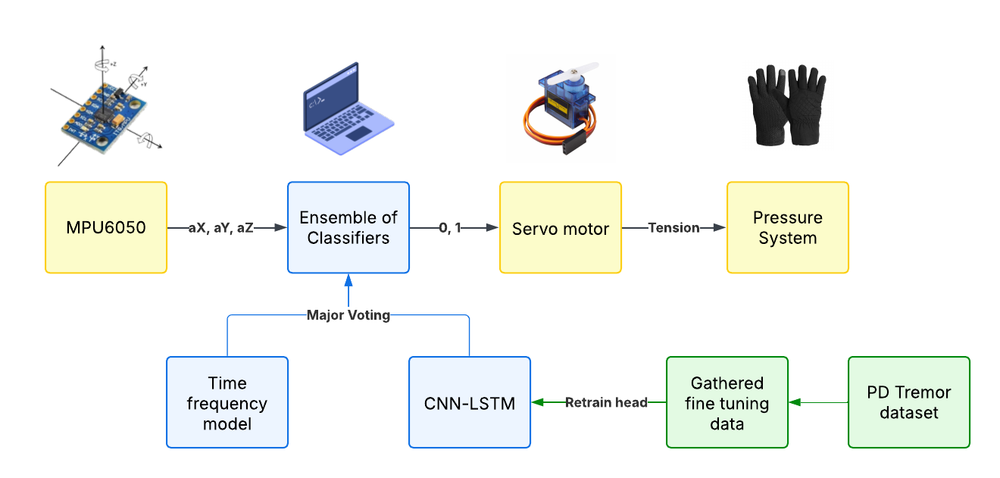
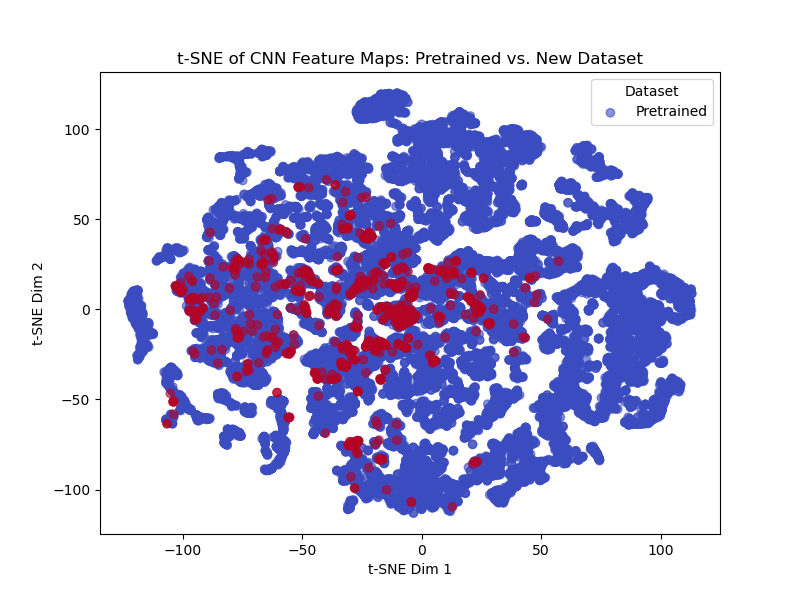
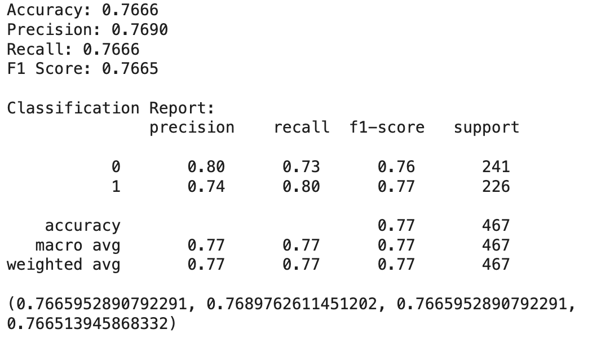

# Hand Tremor Intervention in Neurosurgery

In the 24-hour BMEC hackathon, we used few-shot transfer learning with CNN-LSTM to detect slight hand tremors of neurosurgeons during surgery, ensembled with a simple majority voting system with a sliding window time-frequency analysis. This triggers an intervention using a wearable device consistent of servo actuators to stabalize the hand of the surgeon during operation.

> This project is submitted to BMEC NeuroHacks 2025 at the University of Toronto.

> We will embed a short demo video soon...

## Background

Hand tremors are a common problem in neurosurgery, where even minor tremors can have a significant impact on the outcome of the surgery. This is natural and can be caused by stress, fatigue, or other factors. The current solutions are either too expensive (such as da Vinci robot) or not effective enough and some surgery must be done by hand. Portability and intuitiveness of use is also a need of stakeholders. **The goal of this project is to provide a cost-effective solution that can be used in real-time during surgery.**

## Dataset

Parkinson's disease (PD) tremor dataset is widely available but our use case with smaller tremors is not well represented in the literature. Therefore, we first train a base model on publicly available hand tremor dataset such as [Hand Tremor Dataset](https://www.kaggle.com/datasets/aaryapandya/hand-tremor-dataset-collected-using-mpu9250-sensor) collected using MPU9250 sensor.

We then obtained our custom dataset by simulating tremors and collecting them using a similar MPU6050 sensor on Arduino (code available in `data_collection`). This very small dataset is used for few-shot learning. For visualization use `model/data.ipynb`.

Using tSNE, we have shown the source domain and target domain are close to each other, supporting the viability of few-shot learning. The feature mapping extracted from the CNN-LSTM layers overlap significantly between the two domains.

Therefore, we decided to only fine-tune the feed forward layers of the model on the custom dataset and freeze the CNN-LSTM layers.

## Model

The model is a CNN-LSTM architecture with a few-shot learning approach. 1D CNN is used to extract features from the time series data and LSTM is used to capture the temporal dependencies. The model is trained on the base dataset and fine-tuned on the custom dataset.

The base model achieved an accuracy of 85% with minor manual optimization and little overfitting.

During fine tuning, we freeze the CNN-LSTM layers and only retrain the feed forward layers. This is because the base dataset is large and the custom dataset is small. The final accuracy obtained on our own dataset in 78% in 50 epochs. This is without any data augmentation or other techniques to improve the model. **For improvement, explicit feature engineering is needed as shown in various research paper that achieved 80-90% accuracy for PD tremors.**

This is then ensembled with a simple majority voting system with a sliding window time-frequency analysis. The model is run on the windowed data and the majority vote is taken. This is done to reduce the false positives and false negatives, given that the CNN-LSTM model is not perfect and quite sensitive to the input data, while traditional signal processing methods are not sensitive enough but are robust.

## Intervention

The processing is done on the computer due to limited hardware, but can be easily transferred to a Raspberry Pi or similar device. The intervention is triggered when the majority vote is above a certain threshold and a signal is sent via Serial connection to Arduino UNO. The intervention involves a wearable device with servo motors stretching a rope to apply tension onto the glove of the device to control the shaking of the hand.

In the future, we plan to use piezoelectric actuators for more precise control and feedback.

## Areas of Improvement

- [ ] Improve the model with explicit feature engineering
- [ ] Train 2D CNN on spectrogram data for better feature extraction
- [ ] Improve the time series model and ensemble with other techniques such as bagging or boosting to leverage the strength and weaknesses of different models
- [ ] Evaluate the trained models using 10-fold cross validation
- [ ] Improve the latency of receiving and processing the signal
